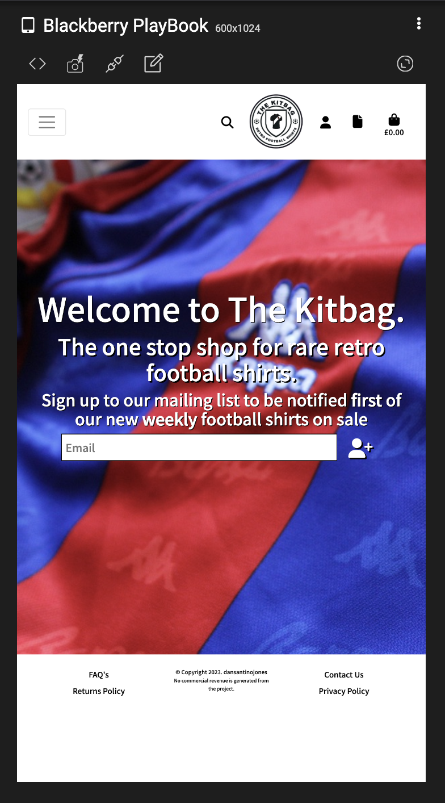

# The Kitbag

## **Introduction**
This online store was created and developed as my final portfolio project for my Full Stack Software Development course with Code Institute. The Kitbag is an e-commerce website selling retro football shirts. Users can register an account, browse shirts on sale, purchase shirts with card payment, view order history and sell shirts.

View the live project here: [The Kitbag](https://the-kitbag.herokuapp.com/)

This is for educational purposes only, please don’t enter your card details.
If you want to test the payment system, use these test card details:  
Card Number: 4242 4242 4242 4242  
Date: 0424  
CVC: 242  
Postcode: 42424

 

 

## **Strategy Plane**
### **Business Goals**
- Sales
- Repeat purchase
- Sign Ups 

 

 

### **Target Audience**
- 18 to 44 year olds
- Football fans
- Collectors
- High disposable income

 

 

### **Competitor Review**
1. [Classic Football Shirts](https://www.classicfootballshirts.co.uk/)

  
Click here to view competitor analysis on Classic Football Shirts

  
  
  
  
 
  

2. [Retro Football Kits](https://www.retrofootballkits.co.uk/)

  
Click here to view competitor analysis on Retro Football Kts

  
  
  
  
 
  

3. [Vintage Football Shirts](https://www.vintagefootballshirts.com/)

  
Click here to view competitor analysis on Vintage Football Shirts 

  
  
  
  
 
  

 

 

## **Scope Plane**
### **User Stories** 
As a shopper:
- As a site user I can register for an account so that I can have a personal account and view my profile.
- As a site user I can login and logout of my account so that access my personal account information.
- As a site user I can have a personalised profile page so that I can view purchase history.
- As a site user I can recover my password incase I forget it so that regain access to my account
- As a site user I can receive an email confirming my account registration so that I know my account was successfully registered.
- As a shopper I can view a list of products so that select one or more to purchase.
- As a shopper I can view individual product details so that I can identify price, size, description and product image.
- As a shopper I can easily view the total of my spending so that avoid spending too much.
- As a shopper I can search products by name and description so that find a specific item to purchase.
- As a shopper I can sort the list of available products so that I can arrange the list by price.
- As a shopper I can view products from specific leagues so that choose from my favourite leagues and narrow my search.
- As a shopper I can select the size and quantity of a product so that I can choose from available sizes and purchase more than one.
- As a shopper I can view items in basket so that identify the total cost view products I've selected to purchase.
- As a shopper I can adjust the quantity of items in my basket so that I can make changes before checkout.
- As a shopper I can easily enter payment information so that I checkout quickly with no hassle.
- As a shopper I can view my order details after checkout so that I can ensure no mistakes were made.
- As a shopper I can receive an email confirmation after checkout so that keep a record of my purchases.
- As a shopper I can sign up to a mailing list so that I can be first notified of new shirts on release.
- As a shopper I can view company reviews so that I can gain trust before making a purchase.
- As a shopper I can leave the company a review so that I can express my satisfaction/dissatisfaction.
- As a shopper I can sell my shirts so that I receive money for old shirts I no longer want.
- As a shopper I can remove items from my basket so that do not have to close the browser to clear the basket.

As an admin:
- As a store owner I can add products so that add new items for sale.
- As a store owner I can edit and update products so that I can change product pricing, images and descriptions.
- As a site owner I can delete products so that I can remove items that are no longer for sale.
- As a site owner I can view orders made by customers so that I can manage the orders.
- As a site owner I can create a mailing list with registered user emails so that I can send out weekly newsletters.
- As a site owner I can manage customer reviews so that I can resolve any issues from dissatisfied customers.
- As a site owner I can see all the relevant details from shirts customers want to sell so that I can make an informed decision on making them an offer.

 

 

### **Agile Methodology** 
The Kitbag was created using the agile approach, from the initial planning and wireframing to building the front and back-end functionalities. I used GitHub project to build a Kanban board to visualise the user stories from ‘To Do’ to ‘In Progress’ to ‘Done’. User Stories that could not be completed were put into ‘Out of Scope’. ’Important’ red tags were used on the User Stories that needed addressing first. ‘Urgent’ yellow tags were used on User Stories that must be included. ‘CRUD’ aqua tags were used to highlight the Admin Stories. 

 

 

### **Milestones** 
- Home
- Registration
- Products
- Basket
- Checkout
- Payment 
- Profile 
- Admin
- Reviews

 

 

## **Structure Plane**
The structure of the pages was carefully planned out when designing the website. I wanted to keep it similar to most e-commerce website structures ensuring that the website is familiar to the user and the content is positioned exactly where the user expects it to be.

 

 

### **Consistent** 
- Header with navigation on all pages.
- Footer displayed on all pages.
- Same font throughout the website. 

 

 

### **Predictable** 
- Clickable logo to take user back to home page.
- Images open in a new window.
- External links open in a new window.

 

 

### **Content Organisation** 
The shirts on sale were displayed on the site using bootstrap cards which stack nicely above each other in mobile view making it easy to browse through the products.

 

 

### **Information Architecture**  
When planning the shirt detail page I put myself in the shoes of the user to understand what information would be most important to the user and how it will be viewed. The most important information in the buyer decision-making process is, image, name, price and size.

 

 

## **Skeleton Plane**  
### **Wireframes** 
Prior to writing any code, initial wireframes were drawn with pencil and paper. Once happy with the layout and design, I used [Figma](https://www.figma.com/) to create my wireframes. It was important to plan and visualise my website across desktop and mobile to ensure I had a clear vision and the execution of writing code was successful.

  
Click here to view Desktop Wireframes:

  
  
  
  
  
 
  

  
Click here to view Mobile Wireframes:

  
  
  
  
  
 
  

 

 

### **Navigation Diagram**
I designed a flowchart using [Lucidchart](https://lucid.app/documents#/documents?folder_id=recent) to help visualise the user experience throughout the website. The milestones are bold to highlight their importance. 

 

 

### **Database Diagram**
I used [DrawSQL](https://drawsql.app/) to create and visualise the database diagram and the relationships between them. 

 

 

## **Surface Plane**
### **Colours** 
The shirts at the store at vibrant and colourful, therefore the main colours chosen for the website are neutral which avoids any colour clashes. I used [Coolors](https://coolors.co/) to create a colour pallet:

 

 

### **Typography** 
The font for the website was chosen using [Google Fonts](https://fonts.google.com/). I decided to use the font 'Noto Sans KR'. Noto is a global font collection for writing in all modern and ancient languages. Noto Sans KR is an unmodulated (Sans Serif) design for the Korean language. I chose this font as it is similar to Sans Serif, I wanted a clear and simple font for the website. 

 

 

### **Icons** 
Icons from [Font Awesome](https://fontawesome.com/) were used throughout the website for visual representation. The icons used are, home, pages, search, basket, phone, email, location, facebook, arrow up and add user.

 

 

### **Features**
- Desktop Header 
The header is consistent on all pages. For larger screen sizes, the header will display a search box, logo, accounts, site info and basket. The leagues menu display's 7 leagues for users to choose from. 

- Leagues Menu 
All shirts on the website are categorised by the teams' leagues. The main nav menu consists of 7 leagues/categories, making it easy for users to browse their favourite leagues. 

- Mobile Header 
The header is consistent on all pages. For medium and smaller screen sizes, the leagues condense into a burger menu. The search icon, logo, accounts, site info and basket are also displayed in the mobile header. 

- Logo 
The logo was created using [Adobe Photoshop](https://www.adobe.com/uk/products/photoshop.html). Design inspiration was taken from popular football club badges. The logo has an imprtant role in the navigation of the website. Users can always return to the home page by clicking on the logo in the header. 

- Search Bar 
The search bar is important for customers to search for specific products. If the search term is identified in the name or description of a product then a list of search results will form for the customer to browse. 

- Dropdowns 
The dropdown menus were created to store additional pages without cluttering the main menu for a more finished look and better site structure. The two dropdown’s are ‘My Account’ and ‘Site Info’. 

- Basket Icon
The basket icon from [Font Awesome](https://fontawesome.com/) has the basket total below it. This allows site users to always view the basket total. 

- Alert Messages 
Alert messages are very important in communicating back to the user once an action is taken. This provides reassurance to the user that their action was completed successfully/uncusessfully. The alert messages are colour coded with green for success, red for error, yellow for alert and blue for info messages. These messages auto-dismiss after a few seconds. 
 
 
 

- Sign Up for Newsletter 

- Register for an account 
Users can register for an account through the 'Register' page. This allows users to create a profile, track their order history and update delivery information. 

- Log in 
Site users can log in to their account once they have registered. 

- Logout 
Site users can log out of their account. 

- Password Reset 
The user has the ability to reset their password using the 'Forgot my password' link. 

- Shirt Cards  
The shirts are displayed on [Bootstrap](https://getbootstrap.com/) cards which stack on top of each other neatly once the screen size is reduced. The shirt card displays the image, name, price and size. The scale effect is used when the cursor hovers over the card. 

- No Image 
If a shirt is added to the store without an image. The no image placeholder image will take its place. 

- Filtering 
The users can filter the products using the ‘Sort by…’ dropdown. This will allow users to filter the products by price and name assisting them with their search. 

- Back to Top Button 
The back to top button plays an important role in the navigation of the website. This allows users to return to the top of the page with a click of a button. This is an example good user experience as users don't have to scroll up once at the bottom of the product list. The button is placed on the right of the screen and uses the [Font Awesome](https://fontawesome.com/) arrow-up icon. 

- Product Count 
The product count notifies users how many products are available in their search or in the specific league category. A home icon is placed next to the product count for users to return to the home page. 

- Shirt Detail 
The shirt detail page includes the image, name, price, size and description. This provides the shopper with all the information they need to make a purchase. Below that there is a 'Keep Shopping' and an 'Add to Basket' button. 

- Add a shirt to the store 
Adding products to the store is only available to site owners. The 'Product Management' page provides a form for the site owner to fill in. 

- Edit a shirt in the store 
The delete a shirt from the store functionality is only available to site owners. Once the blue 'Edit' button is clicked, an edit shirt form will appear for the site user to fill in. 

- Delete a shirt from the store 
The delete a shirt from the store functionality is only available to site owners. Once the red 'Delete' button is clicked, a modal pops up asking if 'Are you sure you want to delete?'. This defence is important to ensure things aren't deleted by mistake. 

- Basket 

- Basket Total 

- Remove from basket 

- Checkout 

- Confirmation 
Once the customer has successfully checked out, they will be directed to the oerder confirmation page. This will show their order details. 

- Confirmation Email 
A confirmation email is sent to the customer once an order has been placed. This has been tested with [Temp Mail](https://temp-mail.org/en/) as seen in the image below. The email will thank the customer and provide their order details. This is an integral part of e-commerce websites as it shows professionalism and builds trust with the customer letting the customer know their order has been placed successfully. 

- Leave a Review 

- Recent Reviews 

- Update Details  
Users have the ability to update their delivery information on the 'Profile' page. This saves their changes and pre-populates the checkout form when placing an order. 

- Order History 
The 'Profile' page displays the user's order history. It is important for users to keep track of their previous orders in one place. The cost, date, time and order number is shown under order history. The order number is a link which will take the user to their order confirmation. 

- Sell a Shirt 
The 'Sell a Shirt' page allows users to fill in a form offering up their shirts for sale. Most fields are required, the user must fill in their contact details and provide images of the shirt. The user will then be contacted if we decide to purchase the shirt from them. 

- Contact Us 
The 'Contact Us' page shows four methods of contact, address, telephone, email and Facebook. The contact methods stack on top of each other on smaller screens. [Font Awesome](https://fontawesome.com/) icons are used. 

- Privacy Policy 
The [Privacy Policy Generator](https://www.privacypolicygenerator.info/) was used to create a Privacy Policy for The Kitbag. It is important to include this on the website as it tells users how and why we are collecting their personal information. From a SEO and Marketing stance, search engine algorithms will find the site trustworthy and prioritise it over websites without one. 

- Returns Policy 
[Termly](https://termly.io/products/refund-return-policy-generator/) was used to create a returns policy. While reducing returns is essential, they can improve customer conversion rates, increase repeat purchases and boost brand perceptions. 

- FAQ's 
The FAQ's page is important in reducing enquiries. This is good customer service and good practice to include this on your website. 

- 404 
A 404 error page will display when a user tries to access a page that doesn't exist. A 'Return to Store' button is provided for users. 

- Footer 
The footer is consistent on all pages of the website. It includes a copyright marker and a disclaimer. Either side, displays links to the FAQ's, Contact Us, Privacy Policy and Returns Policy. 

 

 

### **Future Features**
- Stock Tracker
- Filtering by size
- Randomizer

 

 

## **Business Model**

 

 

## **Marketing Strategy**

 

 

### **SEO**

 

 

### **Keywords** 

 

 

### **Robots.txt**
A robots.txt file was created. This improves the SEO ranking of the website by telling the search engine where not to go and which pages they can't crawl. 

 

 

### **Sitemap**
A sitemap file with a list of important URLs is important for search engines to crawl the website and easily understand the site structure when navigating it. The sitemap was created using [XML-sitemaps.com](https://www.xml-sitemaps.com/).

 

 

### **Social Media Marketing** 
Social media marketing will be integral to the success of The Kitbag. The most popular platform for social media marketing is Facebook: [The Kitbag Facebook](https://www.facebook.com/profile.php?id=100091983074101). This platform provides a link to the website, contact details and opening times. The social media accounts will be used to create interactive posts promoting new stock and encouraging sign-ups, driving traffic to the website and encouraging two-way communication. Once the page is established, paid ads will be considered to directly reach the target market. 

 

 

### **Email Marketing** 
The 'Sign Up to Newsletter' function will generate a mailing list for email marketing. The store will post new products to the store weekly. Users who have signed up for the newsletter will receive first access to these products. [Mail Chimp](https://mailchimp.com/?currency=GBP) will be used to send out weekly newsletters with a call to action driving traffic to the website through email marketing. 

 

 

### **Privacy Policy**
The [Privacy Policy Generator](https://www.privacypolicygenerator.info/) was used to create a Privacy Policy for The Kitbag. It is important to include this on the website as it tells users how and why we are collecting their personal information. From a SEO and Marketing stance, search engine algorithms will find the site trustworthy and prioritise it over websites without one.

 

 

## **Technologies Used** 
- [HTML5](https://www.w3schools.com/html/) was used to create the structure of the website.
- [CSS3](https://www.w3schools.com/css/) was used to style the website.
- [JavaScript](https://www.javascript.com/) was used to add interactivity to the website.
- [Python](https://www.python.org/) was used to build the backend of the website.
- [Django](https://www.djangoproject.com/) was used to build the website.
- [Django Allauth](https://django-allauth.readthedocs.io/en/latest/) was used for all account management.
- [Django Crispy Forms](https://django-crispy-forms.readthedocs.io/en/latest/) was used to render the website forms.
- [PostgresSQL](https://www.postgresql.org/) was used as the database during development.
- [Gunicorn](https://gunicorn.org/) was used to run the application.
- [Bootstrap](https://getbootstrap.com/docs/4.3/getting-started/introduction/) was used to style the website content.
- [Git](https://git-scm.com/) was used for version control to commit and push to GitHub.
- [GitPod](https://www.gitpod.io/) was used to 
- [GitHub](https://github.com/) was used to store the code.
- [Chrome DevTools](https://developer.chrome.com/docs/devtools/) was used to fix errors and test responsiveness.
- [Heroku](https://heroku.com/) was used to deploy the website.
- [Elephant SQL](https://www.elephantsql.com/) was used to host the database.
- [Font Awesome](https://fontawesome.com/) was used for the website icons.
- [Google Fonts](https://fonts.google.com/) was used for the website font.
- [Adobe Photoshop](https://www.adobe.com/uk/products/photoshop.html) was used to design and create the logo.
- [Figma](https://www.figma.com/) was used to design the wireframes.
- [Lucid Charts](https://lucid.app/) was used to design the navigation diagram.
- [DrawSQL](https://drawsql.app/) was used to create database diagrams.
- [Similarweb](https://www.similarweb.com/) was used for competitor analysis.
- [Stripe](https://stripe.com/gb) was used to process the card payment functionality. 
- [Amazon AWS](https://aws.amazon.com/) was used to store the static and media files.
- [Pexels](https://www.pexels.com/) was used for the image on the 'About Us' page.
- [Pixaby](https://pixabay.com/) was used for the background image.
- [Grammarly](https://www.grammarly.com/) was used to check the grammar of the website content.
- [Privacy Policy Generator](https://www.privacypolicygenerator.info/) was used to create the privacy policy.
- [Termly](https://termly.io/products/refund-return-policy-generator/)

 

 

## **Testing** 

### **Secret Key** 
The Django Secret Key was accidentally exposed through GitHub. Since noticing the mistake, I have created a new secret key inside a .env file and hidden it through a gitignore file. The Secret Key exposed in the files does not work as it has since been changed.

 

 

### **User Stories**
✅ Completed:
- As a site user I can register for an account so that I can have a personal account and view my profile.
- As a site user I can login and logout of my account so that access my personal account information.
- As a site user I can have a personalised profile page so that I can view purchase history.
- As a site user I can recover my password incase I forget it so that regain access to my account
- As a site user I can receive an email confirming my account registration so that I know my account was successfully registered.
- As a shopper I can view a list of products so that select one or more to purchase.
- As a shopper I can view individual product details so that I can identify price, size, description and product image.
- As a shopper I can easily view the total of my spending so that avoid spending too much.
- As a shopper I can search products by name and description so that find a specific item to purchase.
- As a shopper I can sort the list of available products so that I can arrange the list by price.
- As a shopper I can view products from specific leagues so that choose from my favourite leagues and narrow my search.
- As a shopper I can view items in basket so that identify the total cost view products I've selected to purchase.
- As a shopper I can easily enter payment information so that I checkout quickly with no hassle.
- As a shopper I can view my order details after checkout so that I can ensure no mistakes were made.
- As a shopper I can receive an email confirmation after checkout so that keep a record of my purchases.
- As a shopper I can sign up to a mailing list so that I can be first notified of new shirts on release.
- As a shopper I can view company reviews so that I can gain trust before making a purchase.
- As a shopper I can leave the company a review so that I can express my satisfaction/dissatisfaction.
- As a shopper I can sell my shirts so that I receive money for old shirts I no longer want.
- As a shopper I can remove items from my basket so that do not have to close the browser to clear the basket.
- As a store owner I can add products so that add new items for sale.
- As a store owner I can edit and update products so that I can change product pricing, images and descriptions.
- As a site owner I can delete products so that I can remove items that are no longer for sale.
- As a site owner I can view orders made by customers so that I can manage the orders.
- As a site owner I can create a mailing list with registered user emails so that I can send out weekly newsletters.
- As a site owner I can manage customer reviews so that I can resolve any issues from dissatisfied customers.
- As a site owner I can see all the relevant details from shirts customers want to sell so that I can make an informed decision on making them an offer. 

❌ Out of Scope:
- As a shopper I can select the size and quantity of a product so that I can choose from available sizes and purchase more than one.
- As a shopper I can adjust the quantity of items in my basket so that I can make changes before checkout.

 

 

### **Manual Testing**
Throughout the debugging process, I identified three errors locally and one on the deployed site: 
1. 'SellShirt' object has no attribute 'is_valid'. 
This was caused as is_valid is only available to call on forms. I was attempting to call this on the 'SellShirt' function instead of the 'SellShirtForm'. 
 

2. The 'image' attribute has no file associated with it. 
This error occurred when products were added without an image. To resolve this I removed the href from the anchor tag containing the placeholder image. 
 

3. Local variable 'orders' referenced before assignment. 
This error appeared when trying to update information on the profile page. I resolved this error by moving the orders variable. 
 

4. Placeholder image not displaying on deployed site. 
The placeholder image was showing locally but did not display on the deployed site. The reason for this was the placeholder image was not included in the S3 Bucket. 
 

 

 

### **Feature Testing**
| Feature      | Description | Result     |
| :---        |    :----:   |          ---: |
| Logo      | Click returns to home page       | ✅   |
| Search Bar   | Shows results from search term       |    ✅    |
| Alert Messages    | Display messages about users action        |   ✅     |
| Product Count   | View number of products        |   ✅    |
| Filtering    | Filter items        |   ✅    |
| Back to Top Button    | Click to go back to top        |    ✅   |
| Add to Basket   | Add items to basket        |    ✅   |
| Remove from Basket   | Remove items from basket        |   ✅    |
| Checkout   |     Use card details to checkout order    |   ✅    |
| Order Confirmation   | Display details after order        |   ✅    |
| Order Confirmation Email   | Receive an email confirmation        |   ✅    |
| Newsletter Sign Up   | Sign up using an email address        |   ✅    |
| Sell a Shirt   | Fill out a form to sell a shirt        |    ✅   |
|  Register   | Users can register for an account        |   ✅   |
| Login   | Users can log in to their account        |   ✅    |
| Logout   | Users can log out of their account        |   ✅    |
| Forgot Password   | Reset password        |   ✅    |
| Add Shirt   | Add a shirt to the store        |   ✅    |
| Edit Shirt   | Edit a shirt from the store        |   ✅    |
| Delete Shirt   | Delete a shirt from the store        |   ✅    |
| Leave a Review   | Post a review        |   ✅   |
| Recent Reviews   | Display recent reviews        |  ✅    |
| Update Information   | Users can update their information        |  ✅    |
| Order History   | Display's users order history        |   ✅    |

 

 

### **HTML Validator**
The [W3C HTML Validator](https://validator.w3.org/) discovered 16 errors and 13 warnings. Here is a list of the issues found through the validator:
- 3 x duplicate id user-options 
These errors were resolved by removing the id as they were unused.

- 7 x duplicate id all-products-link 
These errors were resolved by removing the id as they were unused.

- 4 aria-labelly attribute 
These errors were resolved by removing the aria-labelly as the matching id were removed.

- 1 x no li but li closing tag 
This error was resolved by adding the li opening tag.

- 1 x element a not allowed as a child element of ul 
This error was resolved when the li opening tag was added.

- 13 x comment warning 
These warnings were resolved by changing the comments from ---> to -->

Once these errors and warnings were fixed, I passed the deployed site back through the validator. This was the result: 

 

 

### **CSS Validator** 
The [W3C CSS Validator](https://jigsaw.w3.org/css-validator/) discovered 4 errors and 707 warnings. Here is a list of the errors found through the validator:
- 4x value errors 
These errors were fixed by removing the class as it was not needed.

Once these errors were addressed, I passed the deployed site back through the validator. No errors were returned. However, the warnings were not addressed as they have no detriment to the website.

 

 

### **Colour Contrast Validator** 
The deployed site was entered into the [Colour Contrast Validator](https://color.a11y.com/). This passed with no issues.

 

 

### **Python Linter**
I ran my Python files individually through the [CI Python Linter](https://pep8ci.herokuapp.com/). Here are the results:

| Terminal Errors      | Number of times | Fixed     |
| :---        |    :----:   |          ---: |
| No new line      |   15     | ✅   |
| Blank line contains whitespace   |    4    |    ✅    |
| Line too long    |   36      |    ❌    |
| Trailing whitespace   |    6     |   ✅    |
| Expect 2 blank lines after class / function    |    5    |   ✅    |
| Too many blank lines    |    2     |    ✅   |
| Ambiguous variable name   |    1     |    ❌   |
| At least two lines before inline comment   |    1    |   ✅    |

 

 

### **Responsive**
I used [Responsivley](https://responsively.app/) to test my website across different screen sizes.

  
Click here to view the website on mobile screen size:

  
  
  
  
 
  

  
Click here to view the website on tablet screen size:

  
  
 
  

  

  
Click here to view the website on laptop/desktop screen size:

  
  
 
  

 

 

### **Browsers**
The website has been tested on all the browsers below. No major issues to report on.

|  IE / Edge |   |  Chrome |  Safari |  iOS Safari |  Samsung | |
| --------- | --------- | --------- | --------- | --------- | --------- | --------- |

 

 

### **Lighthouse**

 

 

### **Unfixed Bugs**

 

 

## **Deployment**
### **Code Institute Template**
1. Click the 'Use This Template' button.
2. Name your repository and write a description (optional).
3. Click the 'Create Repository from Template' to create the repository.
4. Click the 'GitPod' button to create a new workspace.
5. When working on the project, ensure to open the workspace from GitPod, this will open your previous workspace ratehr than creating a new one.
6. Use the following commands to commit your work:
- 'git add' adds all the modified files to a staging area.
- 'git commit -m "Write commit message"' commits the changes to the local repository.
- 'git push' pushes all your committed changes to the GitHub repository.

 

 

### **Django Setup**

 

 

### **ElephantSQL Setup**
1. Open ElephantSQL.
2. Register or Login.
3. Click 'Create New Instance'. Create a name and select a region.
4. Confirm new instance by clicking 'Create Instance'.
5. Click the instance you created.
6. Copy the URL to the clipboard.
7. Paste it into your DATABASE_URL = "enter url here" in .env file.

 

 

### **Heroku Setup**
1. Open Heroku.
2. Register or Login.
3. Click 'Create New App'.
4. Enter app name and select the region.
5. Click 'Create App'.
6. Under the 'Deploy' tab, click 'Connect to GitHub'.
7. Enter your GitHub credentials.
8. Search for your repository and click 'Connect'.
9. In the 'Settings' tab, scroll to 'Reveal Config Vars' and copy the ElephantSQL URL from the .env file.
10. In config vars, set PORT to 8000 and add the SECRET_KEY from the .env file.

 

 

### **Stripe Setup** 
1. Register for a [Stripe](https://stripe.com/gb) account.
2. Go to 'Developers' on 'Dashboard'.
3. Go to 'API Keys' to view public and secret key.
4. In .env file add STRIPE_PUCLIC_KEY AND STRIPE_SECERET_KEY.
5. Copy in public and secret keys from Stripe.
6. Head to Heroku and open the app.
7. Click on 'settings' and 'Reveal Config Vars'
8. Add the STRIPE_PUCLIC_KEY AND STRIPE_SECERET_KEY with their keys from Stripe.

 

 

### **Amazon Web Services**
1. Create a [Amazon AWS](https://aws.amazon.com/) account.
2. Open S3 application and create a bucket.
3. Select an AWS Region.
4. Uncheck the 'Block All Public Access' setting and acknowledge that the bucket will be public.
5. In 'Properties', go to the 'Static Website Hosting' and click 'Edit'.
6. Turn on 'Static Website Hosting' and set index.html and errors.html values.
7. In 'Permissions', click 'Edit' on the CORS configuration.
8. Edit 'Bucket Policy' and generate and set configuration 'Bucket Policy'.
9. Go to 'Access Control List' and set list object permission for everyone.
10. Open IAM application and set up a user group.
11. Click on 'Policies' and 'Create Policy'.
12. Click on the JSON tab and import a pre-built Amazon policy called AmazonS3FullAccess.
13. Set following settings in JSON tab.
14. Click 'Review Policy', and provide name and description then 'Create Policy'.
15. Navigate to 'Groups' then 'Permissions' and 'Add Permission' then 'Attach Policy'.
16. Click 'Add User' and create one.
17. Add the user to the group and download the CSV with the user's access credentials.
18. Add the AWS code in settings.py with an environment variable called USE_AWS.

 

 

### **Google Mail**
1. Create a [Gmail](https://mail.google.com) account.
2. Login and go to settings and click Other Google Account Settings.
3. Turn on two-step verification following the steps to enable it.
4. Once verified click on app passwords. Select 'Other' and provide a name. 'Django' for example.
5. Click 'Create' and a 16-digit password will generate. Copy it to your clipboard.
6. In the .env file, add EMAIL_HOST_PASS with the 16-digit password.
7. In the .env file, add EMAIL_HOST_USER with the email address from your gmail account. 
8. Confirm the following values in settings.py and add the variables to your config vars in Heroku to send real emails.

 

 

## **Development**
### **Fork**
1. Log into GitHub and click on repository to download
2. Click the 'Fork' button in the top right-hand corner
3. Select a different owner if necessary
4. Click on 'Create Fork'
5. The repository is now in your account and can be changed (Changes made to a forked repository will not affect the original).

 

 

### **Clone** 
1. Navigate to the main repository page.
2. Click on the 'Code' dropdown menu above the list of files.
3. Choose a method to copy the URL for the repository.
4. In the work environment, open Git Bash and change the current directory to target location for cloned repository.
5. Type 'git clone' followed by the copied URL and press 'Enter'.

 

 

### **Download ZIP**
1. Log into GitHub and click on the repository to download.
2. Select 'Code' and click 'Download Zip'.
3. Once the download is finished, extract ZIP file and use it in the local environment.

 

 

## **Credits** 
1. [Retro Football Shirt Store](https://www.retrofootballshirtstore.com/) for the product images. Go check out their website!
2. [Boutiqe Ado](https://codeinstitute.net/) walkthrough project with Code Institute for site inspiration.

 

 

## **Acknowledgements** 
I would like to thank the tutors at Code Institute and my mentor Chris Quinn for his advice and guidance throughout the project.